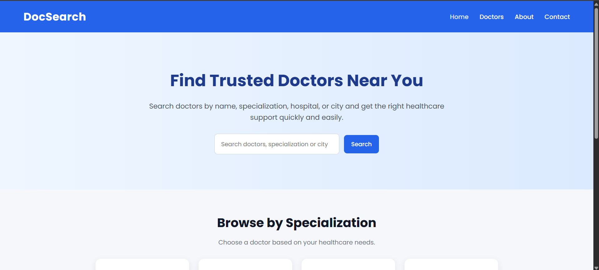
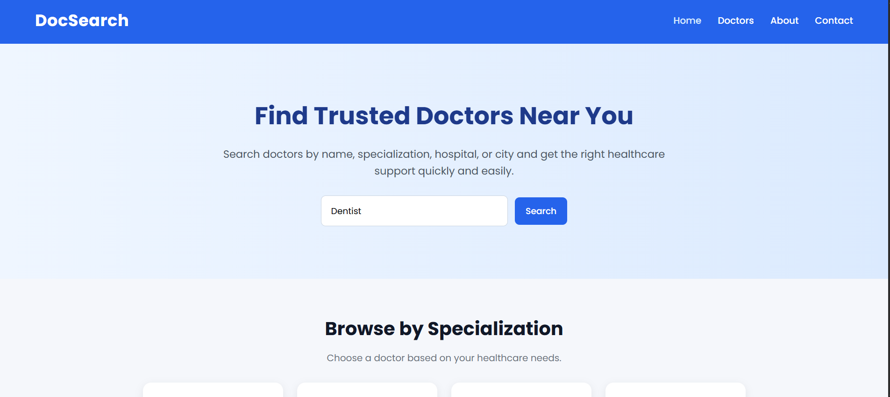
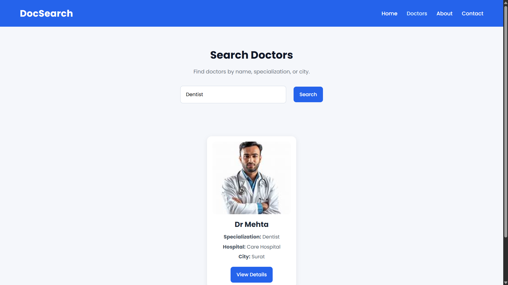

# 🩺 Doctor Search Website

A web application to search and find doctors based on specialization.

## 🔗 Live Demo
http://doctor-search.gt.tc

## 💻 Tech Stack
- HTML
- CSS
- JavaScript
- PHP
- MySQL

## ✨ Features
- Search doctors by specialization
- Display doctor details
- Simple and user-friendly interface

## 📸 Screenshots

### 🏠 Homepage

### 🔍 Search Page

### 📄 Results

## 🚀 Future Improvements
- Add login system
- Add appointment booking
- Add location-based search

## ⚙️ Setup Instructions

1. Clone the repository
2. Import the database file (doctor_search.sql) into phpMyAdmin
3. Update database credentials in db_connect.php
4. Run the project on localhost

## 🔐 Note
Update database username and password before running the project.

## 🧠 How It Works

- User enters doctor specialization
- Frontend sends request using JavaScript
- PHP fetches data from MySQL database
- Results are displayed dynamically

## 👨‍💻 Author
Kamlesh Suva
